Here lies an almost complete chronical of the bikes that made me the cyclist I am today.

## The birth of tinkering, 2012-2015ish
  

  I originally bought the blue eagle for $20 because I needed a seatpost, 
  but decided I liked it more than whatever other thing I was tinkering on.

  I read sheldonbrown.com from start to finish and bought cheap parts off ebay. 
  I doubled downed and bought handlebars, long reach brakes and bar end brake
  levers from velo-orange.

  
  
  The blue eagle lasted a few years, an upgrade to a 6 speed cassette harvested from 
  a bike left on a friends porch, which was donated to me and converted to a fixed gear.

  
  

## A succumbening to hipster-dom, the fixed gear, 2012-2015ish
  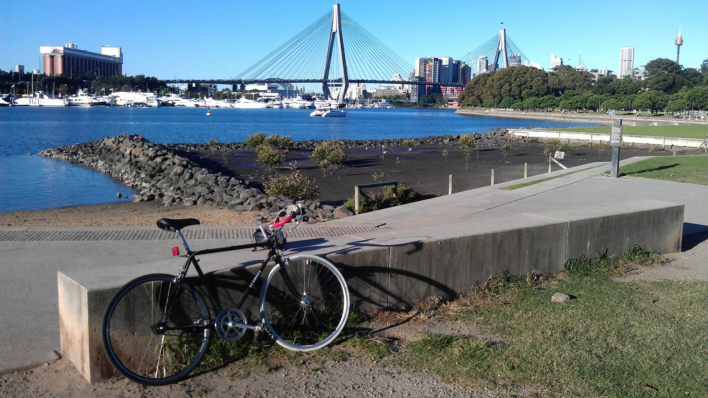
  

  Fixed gears are dumb. I hated them. Don't be such a twat and just
  get some gears. 

  Everyone was saying that fixed gears are so great because they have
  so little maintenance, or that they're cheap, or that you don't need brakes
  because your thighs can crush a fuckin' watermelon, or that all the bike
  messengers in new york use them so they must be super cool.

  It made me irrationally angry, so when a friend moved into a place with
  an abandoned bike on the front porch, I took and converted it into a fixie.
  Fuck, I even sawed the drops to make bullhorns, that's how hard I went.

  Turns out, fixies are really fun and there's no rational reason for it. They just
  are. And maybe the watermelon thing has some merit.

## Actually this one is quite old, 2013-current
  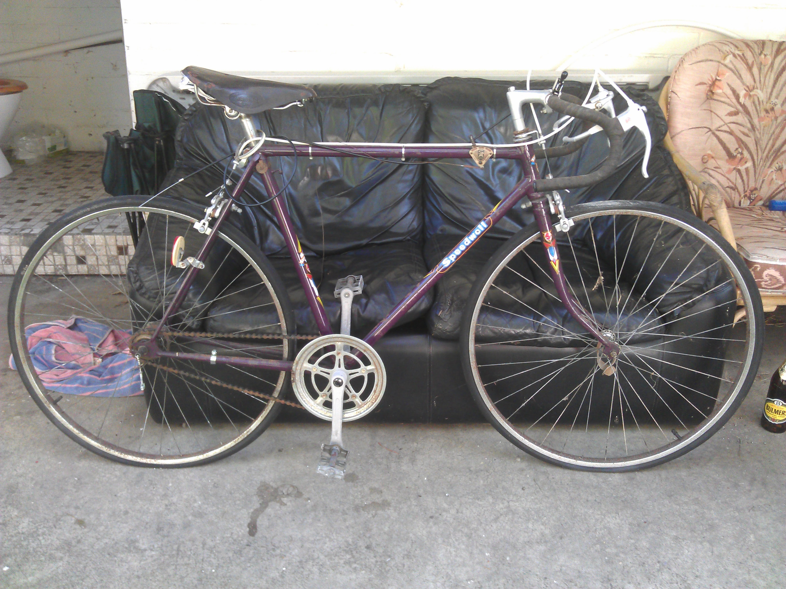
  

  I had two bikes by now, and had bored my family enough with this new found interest
  that I was becoming a "bike guy". My grandparents' neighbour was getting rid of his
  old bike that had been sitting in his backyard shed for some time. So my grandparents
  put me in touch and I went to have a look - I don't need a new bike, but I can have a look
  right.

  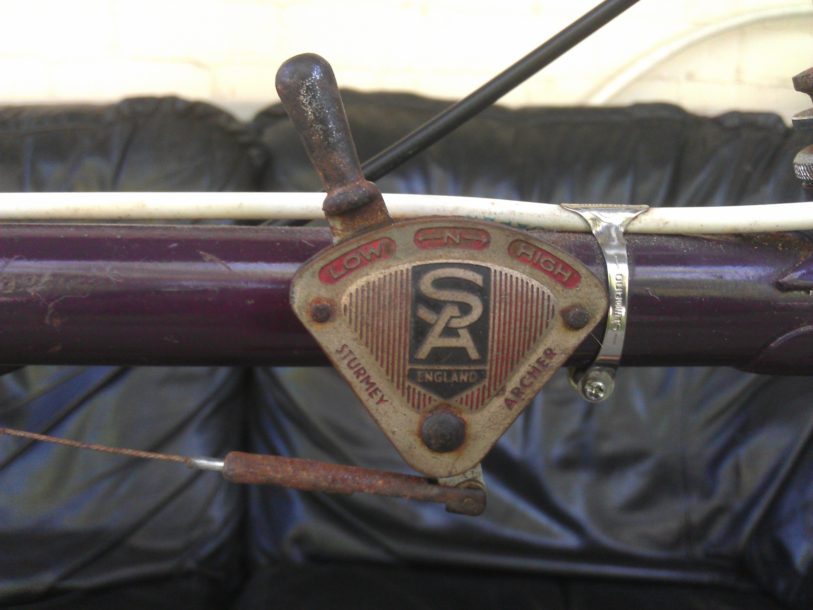
  

  When he said the bike had been sitting in the shed for a while, he meant since the mid-70s.
  He bought it brand new in in 1952. At this time, this bike was more than twice my age
  and I would be its second owner.

  .
  I still have this saddle, but the leather has stretched and the rivets poke uncomfortably into your bum.
  Also, the bike must have leaned against a pole for a long time, as the leather had stretched unevenly](./speedwell_20130512_101429.jpg)
  

  
  

  Originally I did very little to this bike, and just got it running. When I almost crashed in the rain because steel rims are a
  joke, I decided to the get the wheels re-built with aluminium rims. I added some flair with some velo-orange hammered fenders 
  and porteur handlebars as well as a soma porteur rack.

  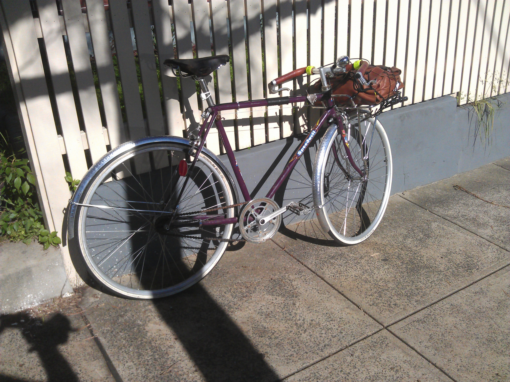
  

  This setup lasted a few months until the old sturmey archer AW shat itself. My trusted bike mechanic told me they could open it up
  but were unsure what they'd be able to do once they did. So I replaced it with a shimano nexus 8. I left the 3 speed shifter on though
  because it was so cool.

  
  

#### A 2018 refresh: Speedwell and the hottest its from the 50s, 70s and now
  

  My main bike shifted to a touring bike in 2016 and the speedwell returned to a shed to await its rebirth. That came in 2018.

  A colleague off-loaded a set of wheels to me with a sturmey archer hub from the late 70s, so again I bought parts to re-fit the
  speedwell, this time as almost a time-capsule on wheels. This was no longer a bike from the 50s with some new parts on it, but a
  trip through history itself - a frame imported from England in the 50s, some wheels from the 70s that weren't properly 
  secured at university, some handlebars from the 2010s mimicing a style from Paris in 30s. Now it's just a nice bike.

  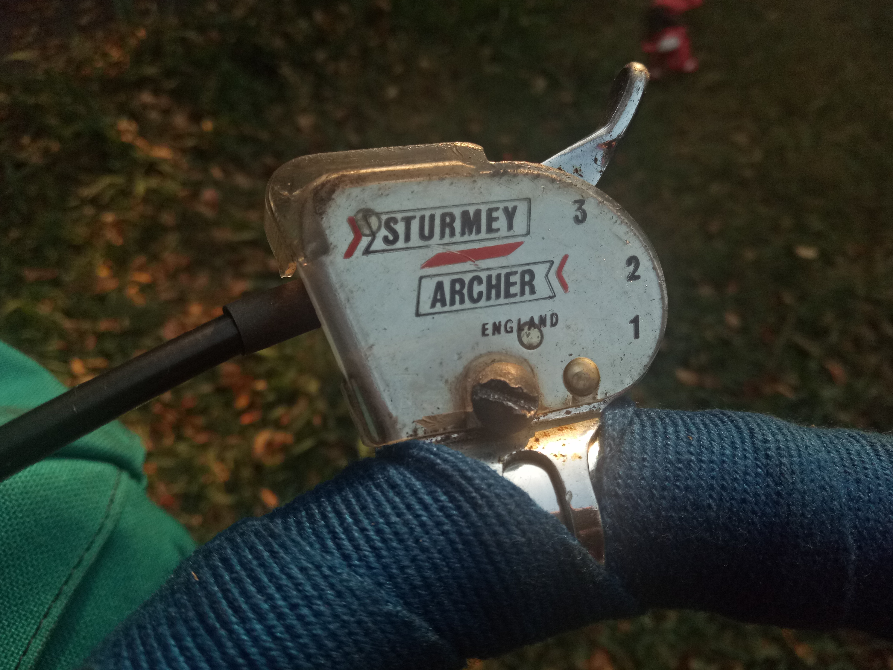
  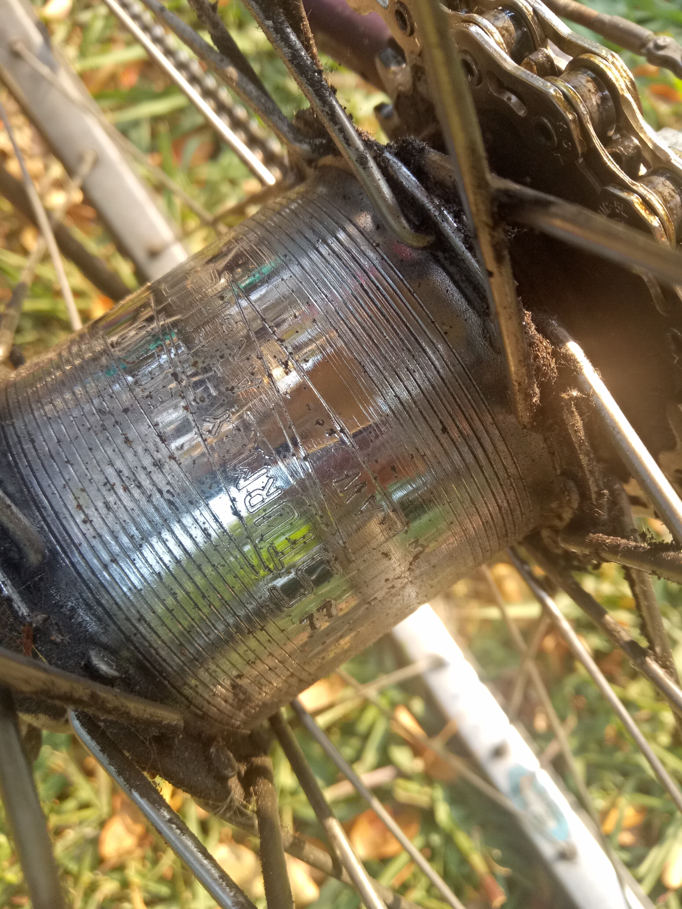
  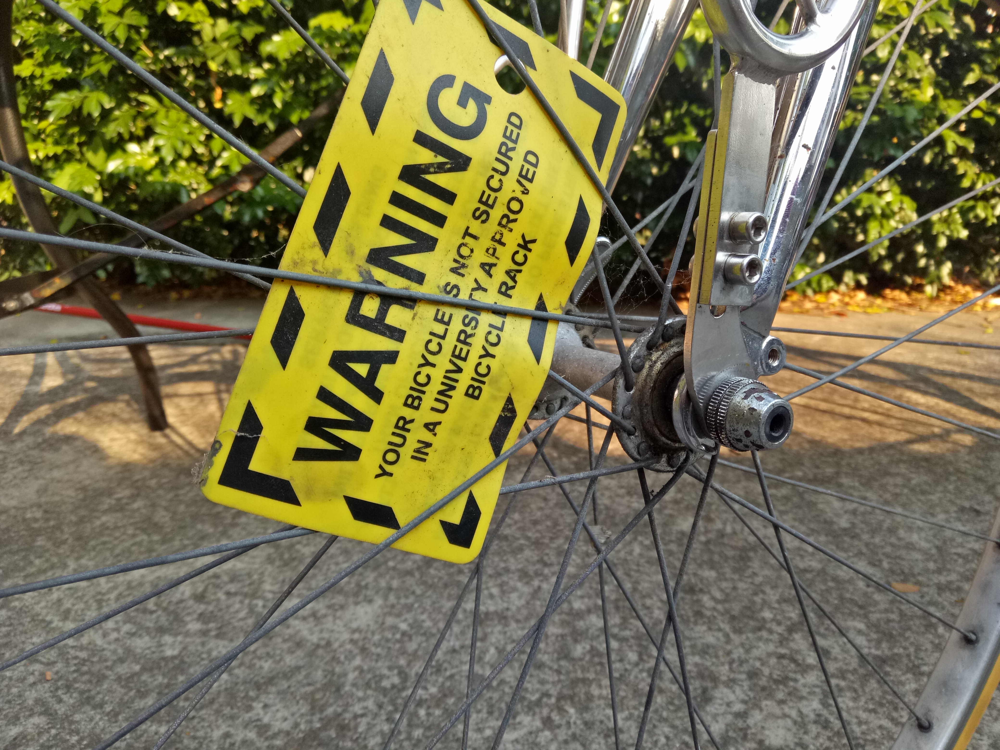

## My knees can sleep when they're dead, ~2015-current
  
  

  A former housemate of mine was pivotal in my descent into bike tinkerdom. Ironically, he 
  was also why I hated fixed gears so much, that is until I rode one.

  This bike started out as his, and I watched him replace every. single. part. on it, except
  the seat post. Some time around 2014/2015, after we'd both moved, he
  gave it to me - he was no longer riding it and didn't want to see it rust on the balcony
  of his coastal apartment.

  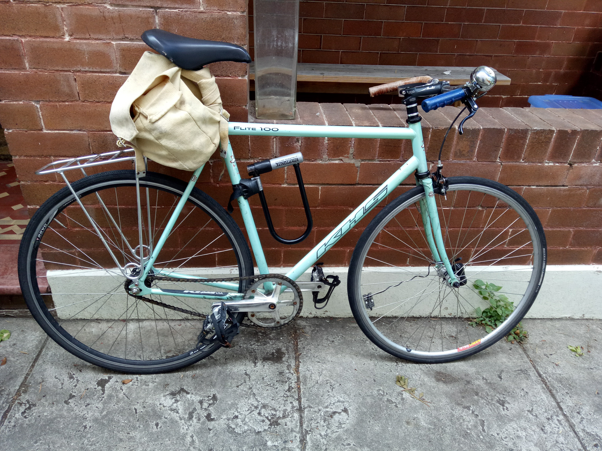
  

  I've not done much to it, except change the handlebars to something more
  my preferred style (VO porteur bars from the speedwell) and give it some
  luggage options depending on what was lying around at the time.

  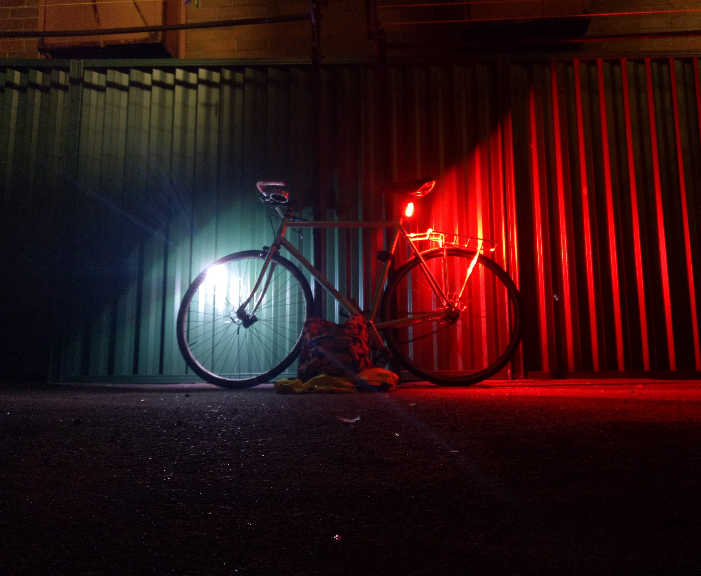
  

## Baby's first tour, 2016-2017
  

  I'd long wanted to go on a bike tour, but it took a good excuse, like a 30th birthday, 
  for me to actually do it. 
  
  The first step was to a get touring bike. By now, you can probably understand that I can't 
  just **buy** one and have some common, off-the-rack bike. No that would be contrary to whole
  point of a coming-of-(an)-age bike tour. I had to build one, and of course I had to  
  base the whole thing around some part that I'd gotten for free.

  That part was a frame, which I found discarded in a back alley, with a seized quill stem,
  and a bottom bracket I'd never seen before or since. The stem came out with the help
  of a hacksaw and a lack of emotional attachment to the fork, and the bottom bracket with wd40, a pipe wrench and eventually
  by clamping the bottom bracket in a bench vice and turning the whole frame.

  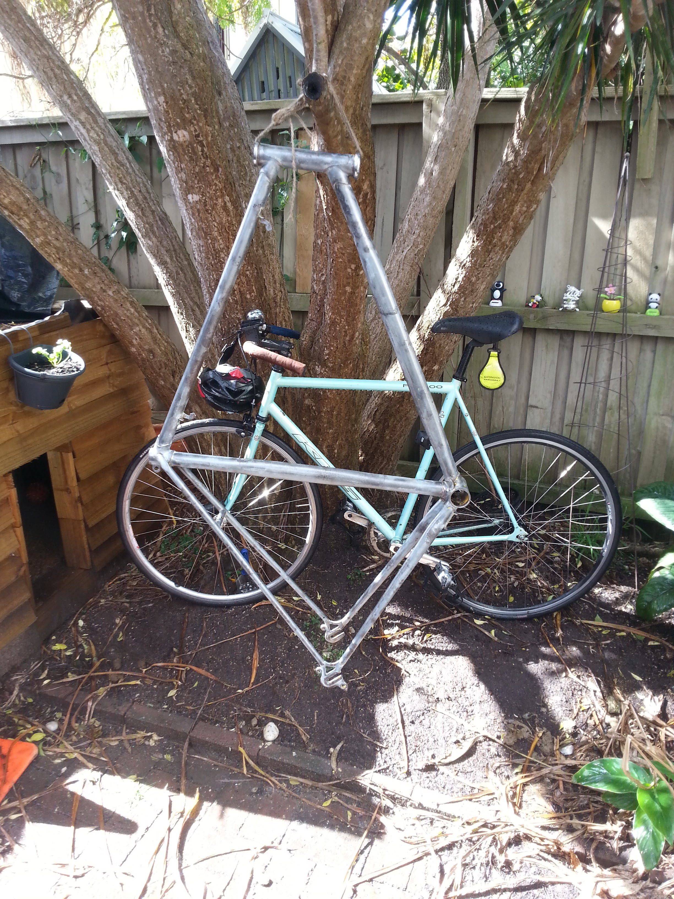
  

  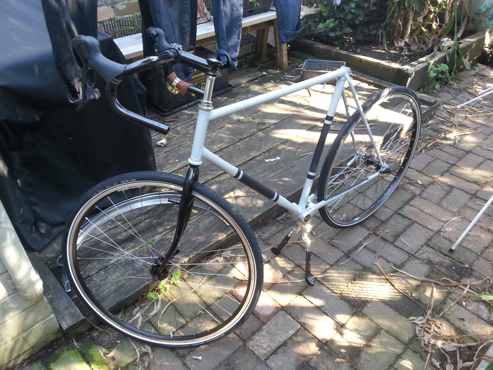
  

  I planned the tour conservatively. I scheduled 40km a day, and took a fortnight off work.
  It took something like 5 days. 10/10 would do again.

#### The hunge
  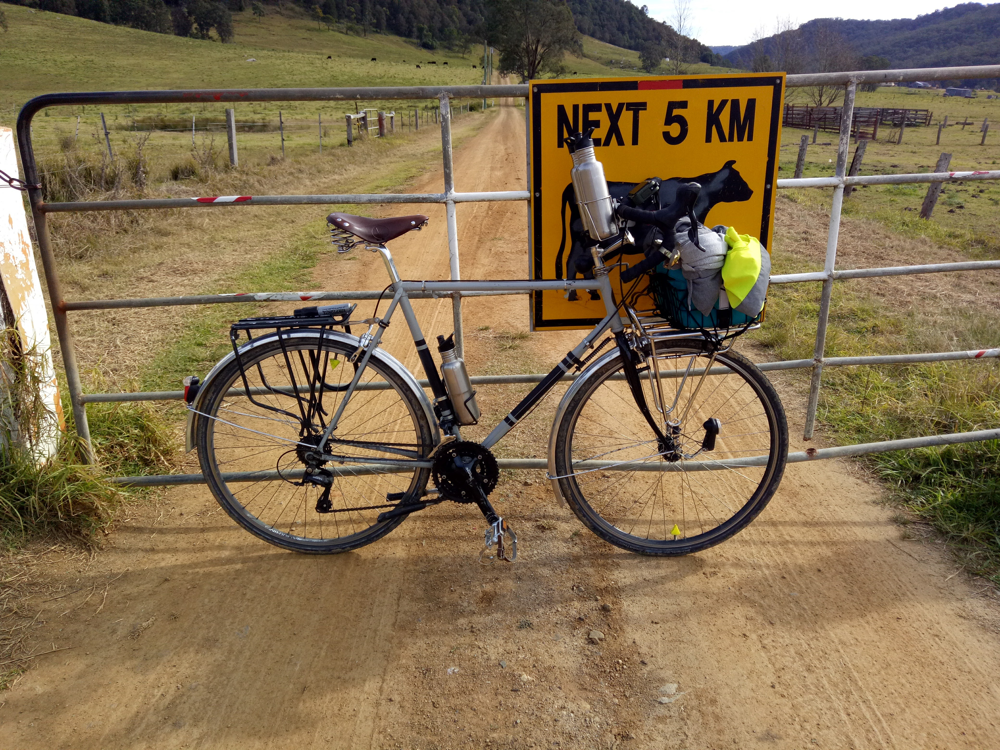
  

  A weekend away with friends in the Hunter Valley was organised and I decided to make my own way there.
  I caught the train to Morrisset and rode the rest of the way through the Olney state forest, meeting
  them at the Wollembi Tavern for lunch along the way.

  This was my longest ride ever and took me all day. I got on the train around 4am and arrived at the airbnb
  just before dark at about 5pm. The whole ride was about 100km, and I only shared about 10 of those with cars.

  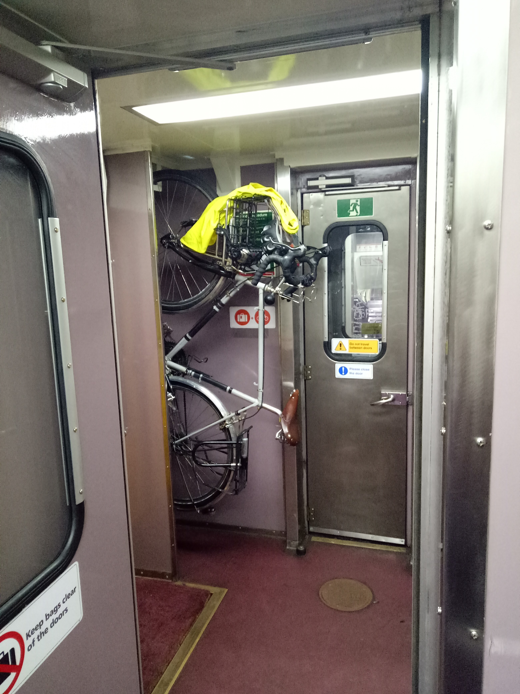
  

## My most expensive bike to date, 2018-current

  

  The cost of a bike is a nebulous concept for me, because I've not really gone to shop and bought one
  that was sitting there ready to go. The surly holds the record for most expensive bike mostly because
  I actually bought everything that's on it, at some point, rather than having been donated bits and pieces.

  It came about because the scalveged frame on the touring bike wasn't quite doing it for me, and I wanted
  something that actually had the bosses to attach the racks and accessories I wanted to attach. I also wanted
  disc brakes.

  Most of the touring bike made its way across to the surly when the frame arrived, and all in all I ended up with...
  basically a stock disc trucker - sora groupset, trp disc brakes (upraded from avid bb5s once I'd had enough of their
  incessant harpy squealing), dia compe bar end shifters. So not only is this the most expensive bike I've ever owned,
  it probably actually cost me more than buying one straight off the shop floor ¯\\\_(ツ)\_/¯ .

## Into the fold, 2019-current

  My new year's resolution for 2019 was to not buy a new bike. I failed.

  I'd been curious as to whether I wanted to a Brompton for quite some time. Come October, during one of
  my regular checks of gumtree, I came across a second hand one for $800. Heccin bargain, how could I pass up? Plus it was my birthday.

  Turns out, it wasn't so much a Brompton, but a near identical knock-off from a Korean brand 3sixty. Anyway, it was cheap and I
  justified its purchase as way of trying the folding lifestyle before I make the $2k, full experience commitment. 

  The seat post wasn't long enough, and was also bent, and crankset fell off while riding and I think the frame is slightly
  bent. So definitely learnt some lessons: yes I do like
  folding bikes, and yes it's probably  worth the cash to get a Brompton. They're just so damn convenient for combining with other forms
  of transit. I can now also ride to the pub, and not have to leave my bike there overnight!

  The shame of buying a cheaper knock-off means I don't yet have pictures. 

#### Edit
  This is me rectifying the lack of picture mentioned above.

  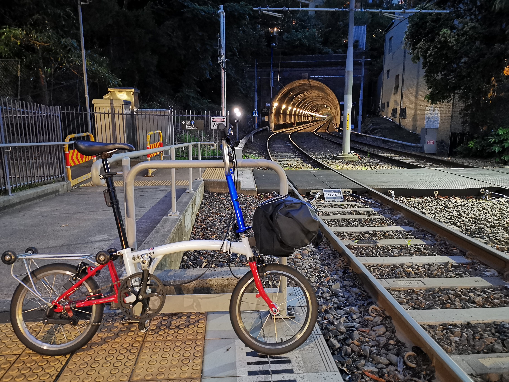
  
